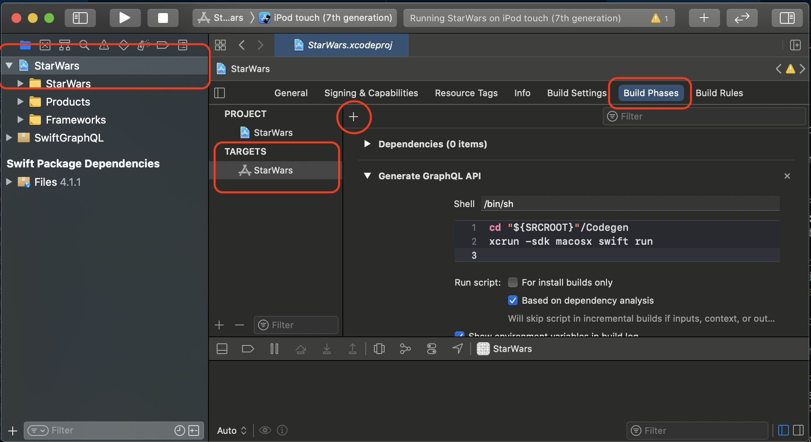

<div align="center"></div>

# 🦅 SwiftGraphQL

> A GraphQL client that lets you forget about GraphQL.

## Features

- ✨ **Intuitive:** You'll forget about the GraphQL layer altogether.
- 🦅 **Swift-First:** It lets you use Swift constructs in favour of GraphQL language.
- 🏖 **Time Saving:** I've built it so you don't have to waste your precous time.
- 🏔 **High Level:** You don't have to worry about naming collisions, variables, _anything_. Just Swift.

## Overview

SwiftGraphQL is a Swift code generator. It lets you create queries using Swift, and guarantees that every query you create is valid.

The library is centered around three core principles:
    
- 🚀 If your project compiles, your queries work.
- 🦉 Use Swift in favour of GraphQL wherever possible.
- 🌳 Your application model should be independent of your schema.

Here's a short preview of the SwiftGraphQL code

```swift
import SwiftGraphQL

// Define a Swift model.
struct Human: Identifiable {
    let id: String
    let name: String
    let homePlanet: String?
}

// Create a selection.
let human = Selection<Human, Objects.Human> {
    Human(
        id: $0.id(), 
        name: $0.name(),
        homePlanet: $0.homePlanet()
    )
}

// Construct a query.
let query = Selection<[Human], Operations.Query> {
    $0.humans(human.list)
}

// Perform the query.
SG.send(query, to: "http://swift-graphql.heroku.com") { result in
    if let data = try? result.get() {
        print(data) // [Human]
    }
}
```

## Installation

To install it using Swift Package Manager, open the following menu item in Xcode:

File > Swift Packages > Add Package Dependency...

In the Choose Package Repository prompt add this url:

```
https://github.com/maticzav/swift-graphql/
```

Then press Next and complete the remaining steps.

To learn more about Swift Package Manager, check out the [official documentation](https://developer.apple.com/documentation/xcode/adding_package_dependencies_to_your_app).

## Why?

__Why bother?__ Simply put, it's going to save you and your team lots of time. There's a high chance that you are currently writing most of your GraphQL queries by hand. If not, there's probably some part of the link between backend and your frontend that you have to do manually. And as you well know, manual work is error-prone. This library is an end to end type-safe. This way, once your app compiles, you know it's going to work.

__Why another GraphQL library?__ There was no other library that would let me fetch my schema, generate the Swift code, build queries in Swift, and easily adapt query results to my model. I was considering using Apollo iOS for my projects, but I couldn't get to the same level of type-safety as with SwiftGraphQL.

> This library has been heavily inspired by Dillon Kearns [elm-graphql](http://github.com/dillonkearns/elm-graphql).

---


## How it works?

It seems like the best way to learn how to use SwiftGraphQL is by understanding how it works behind the scenes.

The first concept that you should know about is `Selection`. Selection lets you select which fields you want to query from a certain GraphQL object. The interesting part about Selection is that there's actually only one `Selection` type, but it has generic extensions . Those generic extensions are using _phantom types_ to differentiate which fields you may select in particular object. 

TLDR; Phantom types let you use Generics to constrain methods to specific types. You can see them at work in the funny looking `Selection<Type, Scope>` parts of the code that let you select what you want to query. You can read more about phantom types [here](https://www.swiftbysundell.com/articles/phantom-types-in-swift/), but for now it suffice to understand that we use `Scope` to limit what you may or may not select in a query.

> Take a breath, pause, think about `Selection`.

Now that you know about selection, let's say that we want to query some fields on our `Human` GraphQL type. The first parameter in `Selection` - `Type` - lets us say what the end "product" of this selection is going to be. This could be a `String`, a `Bool`, a `Human`, a `Droid` - anything. _You decide!_.

The second parameter - `Scope` (or `TypeLock`) - then tells `Selection` which object you want to query.

You can think of these two as:
- `Type`: what your app will receive
- `Scope` what SwiftGraphQL should query.

> Take a breath, pause, think about `Scope` and `Type`.

But how do we _select_ the fields? That's what the `Selection` initializer is for. Selection initializer is a class with methods matching the names of GraphQL fields in your type. When you call a method two things happen. First, the method tells selection that you want to query that field. Secondly, it tries to process the data from the response and returns the data that was supposed to get from that particular field.

For example:

```swift
let human = Selection<Human, Objects.Human> { select in
    Human(
        id: select.id(), // String
        name: select.name(), // String
        homePlanet: select.homePlanet() // String?
    )
}
```

As you may have noticed, `id` returns just a string - not an optional. But how's that possible if the first time we call that function we don't even have the data yet? SwiftGraphQL intuitively mocks the data the first time around to make sure Swift is happy. That value, however, is left unnoticed - you'll never see it.

> Take a breath, pause, think about `Selection`. Again.

Alright! Now that we truly understand `Selection`, let's fetch some data. We use `GraphQLClient`'s `send` method to send queries to the backend. To make sure you are sending the right data, `send` methods only accept selections of `Operations.Query` and `Operations.Mutation`. This way, compiler will tell you if you messed something up.

We construct a query in a very similar fashion to making a human selection.

```swift
let query = Selection<[Human], Operations.Query> {
    $0.humans(human.list)
}
```

The different part now is that `humans` accept another selection - a human selection. Furthermore, each selection let's you make it nullable using `.nullable` or convert it into a list using `.list`. This way, you can query a list of humans or an optional human.

_NOTE:_ We could also simply count the number of humans in the database. We would do that by changing the `Type` to `Int` - we are counting - and use Swift's `count` property on a list.

```swift
let query = Selection<Int, Operations.Query> {
    $0.humans(human.list).count
}
```

> Take a breath. This is it. Pretty neat, huh?! 😄

## Getting started

In the following few sections I want to show you how to set up SwiftGraphQL and create your first query. 

> You can try connecting to your API right away or use `https://swift-graphql.heroku.com` as a playground.

We'll create a code generation build step using SwiftPackage executable and explore the API using XCode autocompletion.

## Generating Swift code

First, we need to somehow generate the code specific to your GraphQL schema. We can do that by creating SwiftPackage executable.

1. Open your terminal and navigate to your project root.
2. Create a folder named `Codegen` next to your application folder and `cd` inside.
3. Run `swift package init --type executable` to initialize your executable.
4. Run `open Package.swift` to open XCode editor and add SwiftGraphQL to your dependencies. (I also recommend using Files by John Sundell as a file navigator, but you can use a library of your choice.)

```swift
// swift-tools-version:5.3
// The swift-tools-version declares the minimum version of Swift required to build this package.

import PackageDescription

let package = Package(
    // ...
    dependencies: [
        /* Depdendencies*/
        .package(name: "SwiftGraphQL", url: "https://github.com/maticzav/swift-graphql", Package.Dependency.Requirement.branch("main")),
        .package(url: "https://github.com/JohnSundell/Files", from: "4.0.0"),
    ],
    targets: [
        .target(
            name: "Codegen",
            dependencies: ["SwiftGraphQL", "Files"]),
    ]
    // ...
)
```

> Don't forget to add both libraries to target depdencies!

5. Now, open up `main.swift` inside your `Sources`. You want to make it look something like this:

```swift
import Files
import Foundation
import SwiftGraphQLCodegen

let endpoint = URL(string: "http://localhost:4000")!

do {
    let target = try Folder.current.parent!
        .subfolder(at: "<APP>")
        .createFile(at: "API.swift").url

    /* Create Generator */
    let scalars: [String: String] = [
        // Here you can map your scalars GraphQL: Swift.
    ]
    let options = GraphQLCodegen.Options(scalarMappings: scalars)
    let generator = GraphQLCodegen(options: options)

    /* Generate the API */
    try generator.generate(target, from: endpoint)
    print("Generated API to \(target.absoluteString)")
} catch let error {
    print("ERROR: \(error.localizedDescription)")
    exit(1)
}
```

> You can checkout more customization options below in documentation.

6. Lastly, you want to add a build step to your project. Click on your project file in XCode and navigate to `Build Phases` after you've selected a target. Click on a _plus_ and name the build step "__Generate GraphQL__". Drag it below the dependencies at the top to make sure it occurs soon enough and paste in the shell below.

```bash
cd "${SRCROOT}"/Codegen
xcrun -sdk macosx swift run
```

<div align="center"></div>


7. 🎉 That's it! You can verify that it's working by building the project and seeing the generated code.

> NOTE: You might need to drag the file into the project/workspace.


---


## Documentation

### `SwiftGraphQL`

- `SwiftGraphQL`

SwiftGraphQL exposes only one method - `send` - that lets you send your query to your server. It uses URLRequest internally and shared URLSession to perform the request, and returns Swift's Request type with the data.

You can pass in the dictionary of  `headers` to implement authorization mechanism.

```swift
SG.send(query, to: "http://localhost:4000") { result in
    if let data = try? result.get() {
        print(data)
    }
}
```

> SwiftGraphQL intentionally doesn't implement any caching mechanism. This is only a query library and it does that very well. You should implement caching functionality yourself, but you probably don't need it in most cases.

### `Selection<Type, Scope>`

- `SwiftGraphQL`

Selection lets you select fields that you want to fetch from the query on a particular type. 

SwiftGraphQL has generated phantom types for your operations, objects, interfaces and unions. You can find them by typing `Unions.`/`Interfaces.`/`Objects.`/`Operations.` followed by a name from your GraphQL schema. You plug those into the `Scope` parameter.

The other parameter `Type` is what your constructor should return.


##### nullable, list, non-nullable fields

Selection packs a collection of utility functions that let you select nullable and list fields using your existing selecitons.
Each selection comes with three calculated properties that let you do that:

- `list` - to query lists
- `nullable` - to query nullable fields
- `nonNullOrFail` - to query nullable fields that should be there


```swift
// Create a non-nullable selection.
let human = Selection<Human, Objects.Human> {
    Human(id: $0.id(), name: $0.name())
}

// Use it with nullable and list fields.
let query = Selection<Void, Operations.Query> {
    let list = $0.humans(human.list)
    let nullable = $0.human(id: "100", human.nullable)
}
```

You can achieve the same effect using `Selection` static functions `.list`, `.nullable`, and `.nonNullOrFail`.

```swift
// Use it with nullable and list fields.
let query = Selection<Void, Operations.Query> {
    let list = $0.humans(Selection.list(human))
}
```

> ⚠️ Don't make any nested calls to the API. Use the first half of the initializer to fetch all the data and return the calculated result. Just don't make nested requests.

```swift
// WRONG!
let human = Selection<String, Objects.Human> { select in
    let message: String
    if select.likesStrawberries() {
        message = select.name()
    } else {
        message = select.homePlanet()
    }
    return message
}

// Correct.
let human = Selection<String, Objects.Human> { select in

    /* Data */
    let likesStrawberries = select.likesStrawberries()
    let name = select.name()
    let homePlanet = select.homePlanet()

    /* Return */
    let message: String
    if likesStrawberries {
        message = name
    } else {
        message = homePlanet
    }
    return message
}
```

### `Union`

- `SwiftGraphQL`

When fetching a union you should provide selections for each of the union sub-types. Additionally, all of those selections should resolve to the same type.

```swift
let characterUnion = Selection<String, Unions.CharacterUnion> {
    $0.on(
        human: .init { $0.funFact() /* String */ },
        droid: .init { $0.primaryFunction() /* String */ }
    )
}
```

You'd usually want to create a Swift enumerator and have different selecitons return different cases.


### `Interfaces`

- `SwiftGraphQL`

Interfaces are very similar to unions. The only difference is that you may query for a common field from the intersection.

```swift
let characterInteface = Selection<String, Interfaces.Character> {
    
    /* Common */
    let name = $0.name()
    
    /* Fragments */
    let about = $0.on(
        droid: Selection<String, Objects.Droid> { droid in droid.primaryFunction() /* String */ },
        human: Selection<String, Objects.Human> { human in human.homePlanet() /* String */ }
    )
    
    return "\(name). \(about)"
}
```

You'd usually want to create a Swift enumerator and have different selecitons return different cases.


### `OptionalArgument`

- `SwiftGraphQL`

GraphQL's `null` value in an input type may be entirely omitted to represent the absence of a value or supplied as `null` to provide `null` value. This comes in especially handy in mutations.

Because of that, every input object that has an optional property accepts an optional argument that may either be `.present(value)`, `.absent` or `.null`.

> NOTE: Every nullable argument is by default absent so you don't have to write boilerplate.


### `Codecs` - Custom Scalars

- `SwiftGraphQL`

SwiftGraphQL lets you implement custom scalars that your schema uses. You can do that by conforming to the `Codec` protocol. It doesn't matter where you implement the codec, it should only be visible to the API so that your app compiles.

```swift
public protocol Codec: Codable & Hashable {
    associatedtype WrappedType
    static var mockValue: WrappedType { get }
}
```

You should provide a codec for every scalar that is not natively supported by GraphQL, or map it to an existing Swift type. You can read more about scalar mappings below, in the generator section of the documentation.

```swift
// DateTime Example
struct DateTime: Codec {
    private var data: Date
    
    init(from date: Date) {
        self.data = date
    }
    
    // MARK: - Public interface
    
    var value: String {
        let formatter = DateFormatter()
        formatter.locale = Locale(identifier: "fr")
        formatter.setLocalizedDateFormatFromTemplate("dd-MM-yyyy")

        return formatter.string(from: self.data)
    }
    
    // MARK: - Codec conformance
    
    // MARK: - Decoder
    init(from decoder: Decoder) throws {
        let container = try decoder.singleValueContainer()
        let value = try container.decode(Int.self)
        
        self.data = Date(timeIntervalSince1970: TimeInterval(value))
    }
    
    // MARK: - Encoder
    func encode(to encoder: Encoder) throws {
        var container = encoder.singleValueContainer()
        try container.encode(Int(data.timeIntervalSince1970))
    }
    
    // MARK: - Mock value
    static var mockValue = DateTime(from: Date())
}
```

> Don't forget to add your scalar mapping to code generator options. Otherwise, generator will fail with _unknown scalar_ error.


### `GraphQLCodegen`

- `SwiftGraphQLCodegen`

Lets you generate the code based on a remote schema. It accepts an optional argument `options`.

Use `.generate` method to generate the code into a specified target. SwiftGraphQL assumes that the target file already exists.

I suggest using John Sundell's Files library for navigation between folders and file creation. Check the example above to see how I use it.

### `GraphQLCodegen.Options`

- `SwiftGraphQLCodegen`

Lets you customize code generation. Accepts one property - `scalarMappings` which should be a dictionary of strings that map keys of GraphQL scalars into Swift scalars.

```swift
let scalars: [String: String] = ["Date": "DateTime"]
let options = GraphQLCodegen.Options(scalarMappings: scalars)
```

---


## F.A.Q


### How do I create a fragment?

Just create a new variable with a selection. In a way, every selection is a fragment!

### How do I create an alias?

You can't. SwiftGraphQL aims to use Swift's high level language features in favour of GraphQL. The primary goal of GraphQL alias is to support fetching same fields with different parameters. SwiftGraphQL automatically manages alias based on the values you provide to a particular field. Because of this, you can select the same field as many times as you'd like.

### My queries include strange alias. What is that about?

SwiftGraphQL uses hashes to construct your queries. There are two parts of the query builder that contribute to the hashes; 
- the first one - _query parameters_ - uses hashes to differentiate between same fields with different parameters. Because of this, you don't have to manually check that your field names don't collide.
- the second one - _query variables_ - uses hashes to link your input values to the part of the query they belong to. SwiftGraphQL laverages Swift's native JSON serialization as I've found it incredibly difficult to represent enumerator values in GraphQL SDL. This way it's also more performant.

```gql
query($__rsdpxy7uqurl: Greeting!, $__l9q38fwdev22: Greeting!, $_b2ryvzutf9x2: ID!) {
  greeting__m9oi5wy5dzot: greeting(input: $__rsdpxy7uqurl)
  character__16agce2xby25o: character(id: $_b2ryvzutf9x2) {
    __typename
    ...on Human {
      homePlanet___5osgbeo0g455: homePlanet
    }
    ...on Droid {
      primaryFunction___5osgbeo0g455: primaryFunction
    }
  }
}
```

### What are the pitfalls in Apollo iOS that you were referring to at the top?

Apollo iOS code generator lets you write your queries upfront and generates the type annotations for them. Let's say that there's a `Human` object type that has a property `friends` (who are also humans). Because you could select different fields in `Human` than in `friends` (sub-`Human`), Apollo generates two different nested structs for "each" of the humans. In TypeScript and JavaScript this is not a problem, since objects are not "locked" into definition. In Swift, however, this becomes problematic as you probably want to represent all your humans in your model with only one human type.

I ended up writing lots of boilerplate just to get it working, and would have to rewrite it in multiple places everytime backend team changed something.


## Roadmap and Contributing

This library is feature complete for our use case. We are actively using it in our production applications and plan to expand it as our needs change. We'll also publish performance updates and bug fixes that we find.

I plan to actively maintain it for many upcoming years. Swift seems like a fantastic language and I've only started learning it.

Feel free to create a pull request with future improvements. Please, document your contributions well, and clearly outline the benefits of the change. It's also very helpful to include the ideas behind changes.

Here's a rough collection of ideas we might tackle next:

- Networking Layer
- Subscriptions
- Caching

> PS.: PRs for the above features will be reviewed a lot more quickly!

## Thank you

I want to dedicate this last secion to everyone who helped me along the way. 
- First, I would like to thank Dillon Kearns, the author of [elm-graphql](http://github.com/dillonkearns/elm-graphql), who inspired me to write the library, and helped me understand the core principles behind his Elm version.
- I would like to thank Peter Albert for giving me a chance to build this library, having faith that it's possible, and all the conversations that helped me push through the difficult parts of it.
- Lastly, I'd like to thank Martijn Walraven and Apollo iOS team, who helped me understand how Apollo GraphQL works, and for the inspiration about the parts of the code I wasn't sure about.

Thank you! 🙌


---


### Licence

MIT @ Matic Zavadlal
